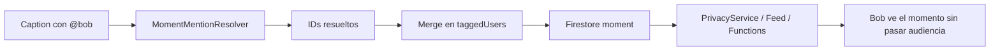

# Plan: menciones en caption vs `taggedUsers` (privacidad)

> **Para quien implemente:** ejecutar por fases; no mezclar ACL de visibilidad con menciones de texto. Marcar tareas con `- [ ]` al avanzar.

**Objetivo:** Evitar que un `@usuario` en el caption (o resolución automática vía `MomentMentionResolver`) conceda acceso al momento cuando la audiencia es privada (`onlyMe`, `custom`, `bestFriends`, etc.).

**Arquitectura:** Separar **quién puede ver** (`taggedUsers` en Firestore, usado por cliente + Functions) de **quién se menciona en texto** (notificación / UI de enlace, sin bypass de audiencia). Endurecer servidor como red de seguridad.

**Stack:** SwiftUI (Moments), `BackgroundMomentUploadService`, `PrivacyService`, Cloud Functions (`functions/index.js`), Firestore, Nova tools.

---

## 1. Diagnóstico (estado actual)

### 1.1 Cadena del fallo



| Capa | Archivo | Comportamiento problemático |
|------|---------|---------------------------|
| Resolución | `Moments/Utilities/MentionParsing.swift` | `@(\w+)` en todo el caption → `fetchUserByUsername` |
| Publicación manual | `CaptionAndDetailsView.swift` ~533–534 | `allTaggedUsers = manual + spatial + captionMentionIds` |
| Nova | `NovaSocialTools.swift` ~97–99 | Mismo merge al publicar |
| Persistencia | `BackgroundMomentUploadService` | `taggedUsers` va a Firestore tal cual |
| Cliente privacidad | `PrivacyService.swift` ~1119–1122 | `taggedUsers.contains(viewer)` → **true antes** de audiencia/bloqueos |
| Feed local | `FeedViewModel.swift` ~850–852 | Mismo fast-path |
| Backend feed | `functions/index.js` `canViewerSeeMoment` ~5725–5727 | `tagged.includes(viewerId)` → true |
| Tagged feed API | `functions/index.js` ~7078–7110 | `array-contains` + solo comprueba estar en `taggedUsers` |

### 1.2 Qué **no** es bug (mantener)

- Etiqueta **manual** en `CaptionAndDetailsView` (`taggedUsers` binding + `UserSearchView`).
- Etiqueta **espacial** en foto (`mediaItem.tags`).
- Mención elegida en el **overlay** de autocompletado (`insertCaptionMention` → añade a `taggedUsers`): es acción explícita; documentar como “etiquetar con acceso”.

### 1.3 Riesgo en datos ya publicados

Momentos privados históricos pueden tener en `taggedUsers` IDs metidos solo por el caption. Hace falta **fase de remediación** opcional (script/Function), no solo código nuevo.

---

## 2. Decisión de producto (acordar antes de codificar)

| Opción | Descripción | Recomendación |
|--------|-------------|----------------|
| **A** | `@` en caption = solo enlace + notificación; **nunca** ACL | ✅ Por defecto |
| **B** | Preguntar al publicar: “¿Dar acceso a @bob?” | Más seguro, más fricción |
| **C** | `@` en caption da acceso solo si audiencia = `everyone` | Parche intermedio; sigue filtrando mal en `connections` |

**Propuesta A (detalle):**

- **`taggedUsers` (ACL):** manual + espacial + mención explícita desde picker (ya en `taggedUsers` al elegir usuario en overlay).
- **`captionMentionUserIds` (nuevo, solo cliente/upload):** IDs resueltos del texto; **no** escribir en `taggedUsers`; usar solo para `sendMomentMentionNotification` tras publicar.
- **UI caption:** seguir resaltando `@user` y navegación a perfil (`MomentMentionLink`); sin cambio visual.
- **Nova:** actualizar prompts: `@` en caption ≠ audiencia `custom`; no implica visibilidad.

---

## 3. Fases de implementación

### Fase 0 — Alineación (30 min, humano)

- [ ] Confirmar opción A/B/C con producto.
- [ ] Definir si mención en caption envía notificación siempre o solo en audiencias públicas (`everyone` / perfil público).
- [ ] Decidir si etiqueta explícita desde overlay sigue dando acceso (recomendado: **sí**).

---

### Fase 1 — Dejar de envenenar `taggedUsers` al publicar

**Archivos:**

- `Moments/Views/Creator/CreatorScreens/CaptionAndDetailsView.swift`
- `Moments/Views/Nova/Tools/NovaSocialTools.swift`
- `Moments/Views/Creator/BackgroundMomentUploadService.swift`
- `Moments/Utilities/MentionParsing.swift` (comentario de contrato)

**Tareas:**

- [ ] **1.1** En `publishMoment()`: `taggedUsers` = `Set(manualTagged + spatial)` únicamente.
- [ ] **1.2** Resolver `captionMentionIds` en paralelo; guardar en nuevo campo `captionMentionUserIds` en `UploadingMoment` (no en Firestore).
- [ ] **1.3** Extender `uploadMoment(...)` con parámetro opcional `captionMentionUserIds: [String]?`.
- [ ] **1.4** Tras `createMomentInFirestore`, notificar menciones de caption con `sendMomentMentionNotification` (excluir autor y IDs ya en `taggedUsers` ACL).
- [ ] **1.5** Mantener `sendPhotoTagNotification` solo para `taggedUsers` ACL (etiquetas reales).
- [ ] **1.6** Misma lógica en `NovaSocialTools.uploadMomentWithImage`.
- [ ] **1.7** Persistencia offline: añadir `captionMentionUserIds` opcional a `MomentUploadPayload` (Codable, default `nil`).

**Criterio de aceptación:**

- Publicar `onlyMe` + caption `"@bob hola"` → bob **no** aparece en `taggedUsers` del documento Firestore.
- Bob puede recibir notificación de mención (si Fase 0 lo permite).
- Bob **no** ve el momento en feed ni en tagged-moments API.

---

### Fase 2 — Endurecer servidor (defensa en profundidad)

**Archivo principal:** `Moments/functions/index.js`

**Tareas:**

- [ ] **2.1** Documentar en `canViewerSeeMoment` que `taggedUsers` = etiqueta con privilegio de vista (intencional).
- [ ] **2.2** (Opcional fuerte) Nuevo campo Firestore `taggedUsersAccess: string[]` y migración; **solo** si queréis separar menciones históricas en DB. Si no, saltar a 2.3.
- [ ] **2.3** Endpoint tagged-moments (~7078): además de `array-contains`, llamar `canViewerSeeMoment` completo (audiencia + bloqueos). Evita listar momentos que el cliente ya ocultaría pero la API expone.
- [ ] **2.4** Reglas Firestore: verificar que lectura de `moments` no confíe solo en `taggedUsers` del doc sin pasar por Functions en rutas sensibles.

**Criterio de aceptación:**

- Request tagged-moments como usuario mencionado solo en caption (dato legacy) + momento `onlyMe` → **no** en respuesta tras 2.3.

---

### Fase 3 — Cliente: alinear todos los fast-paths

**Archivos:**

- `Moments/Services/Privacy/PrivacyService.swift`
- `Moments/Views/Feed/Core/FeedViewModel.swift`
- `Moments/Services/Privacy/PrivacyServiceExtension.swift` (si aplica)
- Cualquier otro `taggedUsers?.contains` encontrado con ripgrep

**Tareas:**

- [ ] **3.1** Inventario: `rg "taggedUsers" Moments/Moments` y clasificar ACL vs UI.
- [ ] **3.2** Dejar fast-path de `taggedUsers` **solo** para etiquetas ACL reales (sin cambio de lógica si Fase 1 ya no mete menciones de caption).
- [ ] **3.3** Añadir test unitario o UI test documentado: momento mock `onlyMe` + `taggedUsers: [victim]` → `canUserViewMoment` false para victim si victim solo venía del caption (test de regresión con fixture).

**Nota:** Tras Fase 1, el cliente nuevo ya no crea el problema; Fase 3 es consistencia + tests.

---

### Fase 4 — Nova y copy

**Archivos:**

- `Moments/Views/Nova/AI/NovaPromptCatalog.swift`
- `Moments/Views/Nova/Agent/NovaToolRegistry.swift`

**Tareas:**

- [ ] **4.1** Sustituir texto “@username … resolved automatically” por: mención en caption = notificación/enlace; visibilidad = parámetro `audience` / etiqueta explícita.
- [ ] **4.2** `momentDraftPrompt`: no usar `audience=custom` para un @ en caption.

---

### Fase 5 — Remediación de datos (opcional, recomendado)

**Objetivo:** Limpiar `taggedUsers` en momentos privados donde el ID solo aparece como @ en `content`.

**Tareas:**

- [ ] **5.1** Script admin (Node en `functions/scripts/` o one-off): para cada `users/*/moments/*` con `audience` ∈ `onlyMe`, `custom`, `customList`, `bestFriends`, `connections`:
  - Parsear `content` con mismo regex `@(\w+)`.
  - Resolver username → uid (batch).
  - `taggedUsers' = taggedUsers.filter(id => id not in captionOnlyIds)` **o** quitar todos los resolubles por caption si no hay etiqueta espacial/manual (más conservador: quitar solo los que coinciden con @ en texto y no están en `mediaItems[].tags`).
- [ ] **5.2** Ejecutar en staging; muestrear 20 docs antes/después.
- [ ] **5.3** Ejecutar en prod con log + backup export.

**Criterio:** Usuario que solo estaba en caption deja de ver momentos privados ajenos en “donde me etiquetaron”.

---

## 4. Plan de pruebas manual

| # | Escenario | Resultado esperado |
|---|-----------|-------------------|
| 1 | `onlyMe` + caption `@user_real` sin picker | `taggedUsers` vacío o sin ese uid; user_real no ve post |
| 2 | `onlyMe` + etiqueta manual user_real | `taggedUsers` contiene uid; user_real **sí** ve (si producto confirma) |
| 3 | `everyone` + caption `@user` | Sin acceso extra necesario; notificación opcional |
| 4 | Nova `create_moment` onlyMe + caption @user | Igual que #1 |
| 5 | Foto con tag espacial + caption @otro | ACL = espacial + manual; @otro solo notificación |
| 6 | tagged-moments API como @otro en #1 | Lista no incluye el momento (post Fase 2) |

---

## 5. Orden de despliegue sugerido

1. **Fase 1** (cliente) — corta fuga nueva en publicaciones.
2. **Fase 2** (Functions) — cierra API/backend.
3. **Fase 4** (Nova copy) — en el mismo release o justo después.
4. **Fase 5** (datos) — ventana de mantenimiento si hay volumen.
5. **Fase 3** (tests/inventario) — en paralelo o tras 1.

---

## 6. Fuera de alcance (por ahora)

- Cambiar semántica de stickers/mentions en **stories** (otro pipeline).
- Comentarios (`FirestoreCommentsRepository.extractMentions`) — revisar en plan aparte si aplica el mismo patrón.
- Rehacer “tab etiquetados” con colección distinta `mentionedInCaption` (solo si producto quiere feed de menciones sin ACL).

---

## 7. Estimación rough

| Fase | Esfuerzo |
|------|----------|
| 0 | 0.5 h |
| 1 | 2–3 h |
| 2 | 2–4 h |
| 3 | 1–2 h |
| 4 | 0.5 h |
| 5 | 4–8 h (depende volumen Firestore) |

**Total mínimo (sin migración):** ~1 día. **Con migración + QA:** 1.5–2 días.

---

## 8. Referencias rápidas en repo

```
Moments/Utilities/MentionParsing.swift          → MomentMentionResolver
Moments/Views/Creator/CreatorScreens/CaptionAndDetailsView.swift
Moments/Views/Nova/Tools/NovaSocialTools.swift
Moments/Views/Creator/BackgroundMomentUploadService.swift
Moments/Services/Privacy/PrivacyService.swift
Moments/Views/Feed/Core/FeedViewModel.swift
Moments/functions/index.js                      → canViewerSeeMoment, tagged-moments
```

---

*Plan creado 2026-05-31. No incluye cambios de código; implementar solo tras cerrar Fase 0.*
